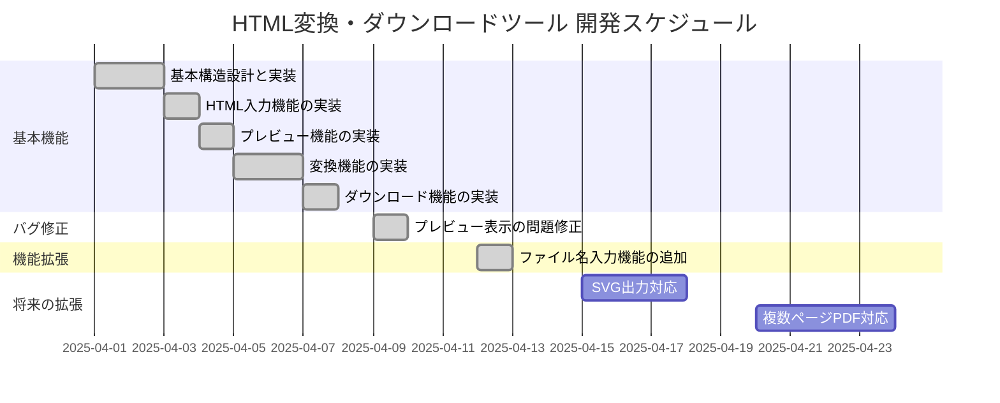

# HTML変換・ダウンロードツール プロジェクト管理

## プロジェクト概要

HTMLコンテンツを画像（PNG/JPEG）、PDF、HTMLファイルとしてダウンロードできるウェブアプリケーションです。ユーザーはHTMLコードを直接入力するか、ファイルをアップロードして、様々な形式でコンテンツを保存することができます。

### 主な機能
- HTMLコードの直接入力またはファイルアップロード
- プレビュー表示
- 画像（PNG/JPEG）形式での保存
- PDF形式での保存
- HTMLファイルでの保存
- カスタマイズ可能な出力設定（ファイル名、背景色、スケールなど）

## 実装計画と進捗状況

## タスク進捗

### 基本機能開発
- [x] 基本的なHTML/CSS/JSの構造設計と実装
- [x] HTMLコードの入力機能
  - [x] テキストエリア入力
  - [x] ファイルアップロード
- [x] プレビュー表示機能
- [x] 画像変換機能
  - [x] PNG形式対応
  - [x] JPEG形式対応（品質設定付き）
- [x] PDF変換機能
- [x] HTMLダウンロード機能
- [x] 出力設定のカスタマイズ
  - [x] 背景色設定
  - [x] スケール設定
  - [x] JPEG品質設定

### バグ修正
- [x] プレビュー表示の問題修正（2025-04-09）
  - [x] iframeを使用したプレビュー表示の実装
  - [x] プレビューフレームのサイズ自動調整

### 機能拡張
- [x] ファイル名入力機能（2025-04-12）
  - [x] UIでのファイル名入力欄の追加
  - [x] ダウンロード前のファイル名確認プロンプト
  - [x] 各形式ごとのデフォルトファイル名プレフィックス設定

### 将来の拡張計画
- [ ] SVG形式での出力対応
- [ ] 複数ページのPDF出力対応
- [ ] CSS/JSの外部ファイル参照対応
- [ ] モバイルUIの最適化
- [ ] ダークモード対応

## 実装詳細と重要な決定事項

### HTML・CSSの構造
- モバイルファーストのレスポンシブデザイン
- タブ切り替え式のUIで入力方法を選択可能に
- グリッドレイアウトを使用して入力部分とプレビュー部分を並べる

### JavaScript実装
- `html2canvas`ライブラリを使用した画像変換
- `FileSaver.js`を使用したファイル保存
- `jspdf.umd.min.js`を使用したPDF変換
- モバイル端末検出とモバイル対応処理

### 重要な決定事項
1. **プレビュー方式の変更** (2025-04-09)
   - div要素からiframeベースのプレビューに変更
   - 理由：スタイルの分離とよりリアルなプレビュー表示のため

2. **ファイル名指定方法** (2025-04-12)
   - 共通のファイル名入力欄を設け、未入力時はプロンプト表示
   - 理由：異なる形式でも同じファイル名を簡単に使用できるようにするため

3. **iOS Safariへの特別対応**
   - 直接ダウンロードが難しいため、代替手段として新しいタブでの表示と保存手順を案内
   - 理由：iOS Safariのセキュリティ制限に対応するため

## 各チェックポイントでの進捗状況

### 2025-04-07: 基本機能の完成
- 基本的な機能（入力、変換、ダウンロード）が実装完了
- 初期バージョンのリリース

### 2025-04-09: プレビュー表示機能の修正
- プレビュー表示関連のバグを修正
- プレビュー表示方式をiframeベースに変更
- 詳細はCHANGELOG.mdを参照

### 2025-04-12: ファイル名入力機能の実装
- ファイル名をユーザーが指定できる機能を追加
- ダウンロード前のファイル名確認プロンプトの実装
- 詳細はCHANGELOG.mdを参照
